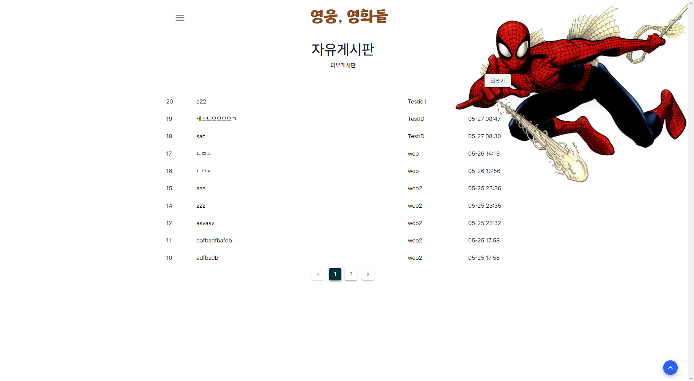
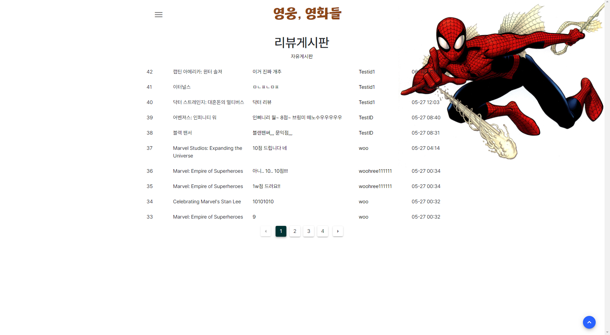

# 영웅, 영화들

> 백엔드(drf) - 김민식, 프론트엔드(vue) - 이우현
>
> 2022-05-20 ~ 2022-05-26

### 히어로 영화들만 모아 볼 수 있는 사이트


#### 주요기능

##### 1. 추천 영화

유저의 좋아요, 리뷰(+평점) 정보를 기반으로 영화를 추천해준다.


##### 2. 리뷰 등록

영화에 마우스를 올리면, 별점을 줄 수 있다. 별점을 누르면 리뷰 등록 페이지로 이동


##### 3. 상세정보 및 좋아요!

영화 상세정보 페이지에서 하트를 누르면 좋아요 반영


##### 4. 그 외

좌측 상단의 메뉴 버튼을 누르면, 메뉴를 확인할 수 있다. 리뷰 게시판과 자유 게시판이 있으며, 내 정보에서 내가 쓴 글 혹은 좋아요나 리뷰 등을 확인할 수 있다.






##### 5. 추천 알고리즘

```python
# 영화추천 알고리즘
@api_view(['GET'])
def movie_recommendation(request):
    user = request.user
    fav_movies = user.fav_movies.all()
    voted_movies = Movie.objects.filter(id__in=request.user.voted_movies.values_list('movie'))
    wished_movies = Movie.objects.filter(id__in=request.user.wished_movies.all())
    user_keywords = {}
    queried_movies = []

    # 유저 선호 영화
    for fav_movie in fav_movies:
        for keyword_id in fav_movie.keywords.values_list('id'):
            if keyword_id[0] not in user_keywords:
                user_keywords.update({keyword_id[0]: 1})
            else:
                user_keywords[keyword_id[0]] += 1

    # 유저가 평점을 준 영화
    for voted_movie in voted_movies:
        score = voted_movie.votes.values_list('score')[0][0]
        # 평점에 가중치 적용
        weighted_score = (score - 5) / 2
        for keyword_id in voted_movie.keywords.values_list('id'):
            if keyword_id[0] not in user_keywords:
                user_keywords.update({keyword_id[0]: weighted_score})
            else:
                user_keywords[keyword_id[0]] += weighted_score

    # 유저가 찜해놓은 영화
    for wished_movie in wished_movies:
        for keyword_id in wished_movie.keywords.values_list('id'):
            if keyword_id[0] not in user_keywords:
                user_keywords.update({keyword_id[0]: 1})
            else:
                user_keywords[keyword_id[0]] += 1

    # 점수가 매겨진 키워드들을 내림차순 정렬
    sorted_keyword_ids = sorted(user_keywords, key=user_keywords.get, reverse=True)
    for sorted_keyword_id in sorted_keyword_ids:
        keyword = get_object_or_404(Keyword, id=sorted_keyword_id)
        # 조건 : 평정 7 이상, 평점 준 사람 1000 명 이상, 본 적 없음, 개봉됨, 평점 내림차순 정렬
        keyworded_movies = keyword.movies.filter(vote_average__gt=7, vote_count__gt=1000).exclude(id__in=voted_movies).order_by('-vote_average')[:6]
        queried_movies.extend(keyworded_movies)
    
    queried_movies = list(dict.fromkeys(queried_movies))
    # 정렬된 영화 객체 리스트를 콘푸로스트라이즈
    serializer = MovieListSerializer(queried_movies, many=True)
    return Response(serializer.data)
```


### 느낀점

프론트와 백 간의 소통이 정말 중요하고, 그만큼 어렵다는 걸 정말 절절히 느꼈던 프로젝트. 우여곡절만큼이나 기억에 오래 남을 것 같다. 민식아 고생 정말 많았다.

싸피에서 처음 웹 개발을 시작하고 5개월이나 지났다. 첫 프로젝트라 부족한 점도 많고, 미완인 부분도 존재한다. 이쁘게 봐줘잉 > <
